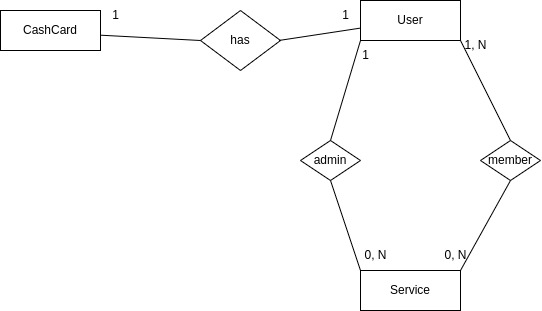

# AssinaJunto
Plataforma para dividir assinaturas de serviços entre membros

### Service:
 - nome
 - valor total (+ taxa uso do sistema)
 - total de vagas
 - vagas ocupadas (1: admin)
 - valor mensal / usuário (varia de acordo com nº de usuários)
 - admin : User
	- pode ter +1 vaga
 - lista de users : List<User>
	- pode ter + de 1 vaga

### User
 - nome
 - email
 - username
 - password
 - ativo (boolean) -> inicialmente False (muda para True com depósito de R$ / muda para False quando não tem saldo para pagar Services)
 - cashcard : CashCard

### CashCard
 - saldo
 - user : User

